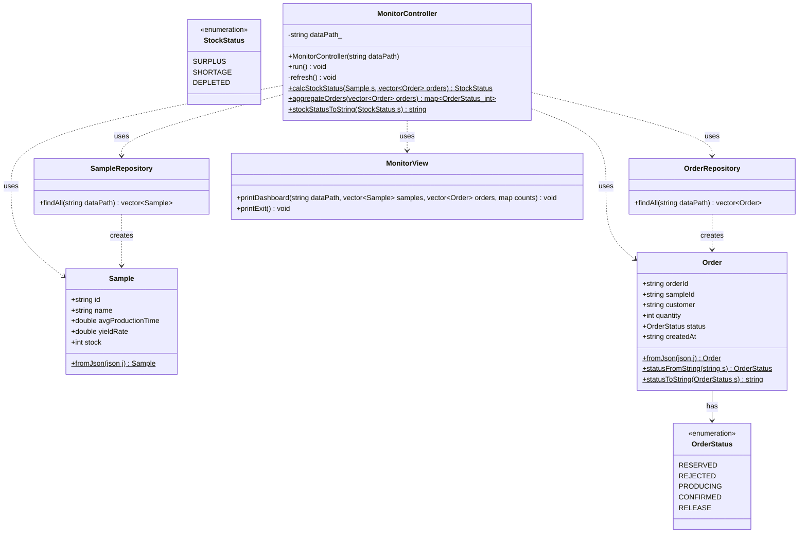

# DataMonitor — PoC 3: 실시간 데이터 모니터링 대시보드

본 프로젝트(SampleOrderSystem)의 `data/` 디렉터리를 읽어
**시료 재고 현황**과 **주문 상태 집계**를 실시간으로 표시하는 모니터링 도구입니다.

---

## 목차

1. [DataMonitor란?](#1-datamonitor란)
2. [핵심 학습 포인트](#2-핵심-학습-포인트)
3. [레이어 구조](#3-레이어-구조)
4. [클래스 다이어그램](#4-클래스-다이어그램)
5. [핵심 코드 설명](#5-핵심-코드-설명)
6. [코드 동작 흐름](#6-코드-동작-흐름)
7. [테스트 하네스 (TDD)](#7-테스트-하네스-tdd)
8. [프로젝트 구조](#8-프로젝트-구조)
9. [빌드 및 실행](#9-빌드-및-실행)
10. [입출력 예시](#10-입출력-예시)

---

## 1. DataMonitor란?

본 프로젝트(SampleOrderSystem)의 `data/` 디렉터리에 있는 JSON 파일을 **읽기 전용**으로 읽어,
재고 현황과 주문 상태를 콘솔 대시보드로 표시합니다.

```
====================================================================
 S-Semi 데이터 모니터 |  2026-07-15 10:32:15  |  [R] 새로고침  [Q] 종료
====================================================================
 [주문 현황]
--------------------------------------------------------------------
  RESERVED    PRODUCING   CONFIRMED   RELEASE
      2            1           1         1
====================================================================
 [시료 재고 현황]
--------------------------------------------------------------------
  ID       시료명                 재고    상태  재고바
  S-001    실리콘 웨이퍼-8인치      480     여유  ################
  S-002    GaN 기판                   0     고갈  ................
  S-003    SiC 기판                  50     부족  ####............
  S-004    InP 기판                 120     여유  #########.......
====================================================================
 경로: .\data  |  자동갱신: 3초
====================================================================
```

**검증 목적**: 본 프로젝트 `data/samples.json`, `data/orders.json` 직접 읽음

---

## 2. 핵심 학습 포인트

### 이 PoC에서 다루는 C++ 개념

| 개념 | 설명 | 사용된 곳 |
|---|---|---|
| `std::filesystem` | 파일 존재 여부 확인, 경로 조립 | `SampleRepository::findAll` |
| `nlohmann::json::parse` (no-throw) | 파싱 실패 시 crash 없이 `discarded` 반환 | `SampleRepository`, `OrderRepository` |
| `enum class` | 타입 안전한 상태 열거형 (`OrderStatus`) | `Order.h` |
| Windows Console API | `GetNumberOfConsoleInputEvents`, `ReadConsoleInput` | `MonitorController::run` |
| `GetFileType(FILE_TYPE_CHAR)` | 핸들이 실제 콘솔인지 파이프인지 확인 | `MonitorController::run` |
| `FillConsoleOutputCharacter` | 콘솔 버퍼 전체를 공백으로 덮어 깜빡임 없이 화면 갱신 | `MonitorView::printDashboard` |
| `#define NOMINMAX` | Windows `min/max` 매크로로 인한 `std::clamp`/`std::max` 충돌 방지 | 모든 windows.h 포함 파일 |

---

### 설계 결정 사항

- **`_kbhit()` 대신 `GetNumberOfConsoleInputEvents` 사용**
  - `_kbhit()`는 마우스/창 크기 이벤트에도 `true`를 반환함
  - 이후 `_getch()`가 실제 키 입력이 없는 상태에서 무한 블로킹 → 프리즈 발생
  - `GetNumberOfConsoleInputEvents`는 버퍼에 있는 이벤트 수를 비블로킹으로 반환하므로, 정확히 그 수만큼 `ReadConsoleInput` 호출 → 블로킹 불가능

- **읽기 전용 Repository 설계**
  - 모니터링 도구는 데이터를 절대 수정하지 않으므로 `save()`, `update()` 없이 `findAll()` 함수만 구현
  - 단방향 데이터 흐름을 강제해 실수로 데이터를 변경하는 경우를 원천 차단

- **파일 없음/파싱 오류 안전 처리**
  - `!fs::exists(file)` 검사 후 빈 벡터 반환 → 파일이 없어도 크래시 없음
  - `nlohmann::json::parse(f, nullptr, false)` 세 번째 인자 `false`가 오류 시 `discarded` 반환
  - `j.is_discarded()` 검사 후 JSON이 깨졌어도 안전하게 빈 목록 반환

- **`SetConsoleCursorPosition(0,0)` 단독 사용 금지**
  - 콘솔이 스크롤된 상태에서는 커서 복귀만으로 이전 내용이 남아 출력이 겹침
  - `FillConsoleOutputCharacter`로 버퍼 전체를 공백으로 채운 뒤 커서를 원점으로 복귀해야 깜빡임 없이 갱신

---

### 흔한 실수 / 주의사항

- **`ReadConsoleInput`을 이벤트 수 확인 없이 바로 호출하면 프리즈**
  버퍼가 비어있으면 다음 이벤트가 올 때까지 무한 대기.
  반드시 `GetNumberOfConsoleInputEvents`로 개수 확인 후 그 수만큼만 호출할 것

- **`windows.h` 포함 전 `#define NOMINMAX` 필수**
  Windows SDK가 `min`, `max`를 매크로로 정의하면 `std::max`, `std::clamp` 컴파일 오류 발생. 각 `.cpp` 파일마다 `windows.h` 앞에 선언해야 함

- **콘솔 환경이 아닐 때 무조건 Console API 호출 금지**
  VS 디버거, CI 파이프라인, 리다이렉트 환경에서는 `GetStdHandle`이 유효한 콘솔 핸들을 반환하지 않음.
  `GetFileType(hIn) == FILE_TYPE_CHAR`로 먼저 확인하고, 콘솔이 아니면 `ReadConsoleInput` 호출 블록을 건너뛸 것

- **모니터링 도구에서 `data/` 파일을 쓰는 경우**
  본 프로젝트가 별도로 `data/`를 관리하는데, 실수로 `ofstream`으로 파일을 열어 기존 데이터가 유실될 수 있음

---

### 본 프로젝트(SampleOrderSystem)와의 연관

| 이 PoC에서 검증한 내용 | 본 프로젝트 적용 위치 |
|---|---|
| `samples.json` / `orders.json` 스키마 그대로 파싱 | `SampleRepository`, `OrderRepository` 완성 시 동일한 스키마 사용 |
| 재고 상태 판정 로직 (여유/부족/고갈) | 모니터링 화면 항목 `[4]` 재고 현황 표시와 동일 로직 적용 |
| REJECTED 주문 집계 제외 | 모니터링에서 REJECTED는 정상 처리 완료로 보고 표시하지 않음 |
| 읽기 전용 Repository 설계 | 모니터링 화면은 데이터 변경 없이 조회만 수행 |

---

## 3. 레이어 구조

```
┌────────────────────────────────────────┐
│              MonitorView               │
│  · 대시보드 출력 (cout 전담)            │
│  · 재고 현황 및 상태 바 표시·시간 포함  │
└────────────────────┬───────────────────┘
                     │ 데이터 전달
┌────────────────────▼───────────────────┐
│           MonitorController            │
│  · 비즈니스 로직: calcStockStatus      │
│                   aggregateOrders      │
│  · 자동/수동 갱신 루프 (3초, R=수동)   │
└──────────┬─────────────────┬───────────┘
           │                 │
┌──────────▼──────┐  ┌───────▼──────────┐
│ SampleRepository│  │ OrderRepository   │
│ samples.json 읽기│  │ orders.json 읽기  │
└──────────┬──────┘  └───────┬──────────┘
           │                 │
┌──────────▼──────┐  ┌───────▼──────────┐
│ Sample (struct) │  │  Order (struct)   │
│ fromJson()      │  │  fromJson()       │
│                 │  │  statusFromString()│
└─────────────────┘  └──────────────────┘
```

---

## 4. 클래스 다이어그램



---

## 5. 핵심 코드 설명

### 5-1. Model — `Sample` / `Order`

```cpp
struct Sample {
    std::string id;                // "S-001"
    std::string name;              // "실리콘 웨이퍼-8인치"
    double      avgProductionTime; // 0.5 (min/ea)
    double      yieldRate;         // 0.92 (수율)
    int         stock;             // 480 (재고)

    static Sample fromJson(const nlohmann::json& j);
};
```

```cpp
enum class OrderStatus { RESERVED, REJECTED, PRODUCING, CONFIRMED, RELEASE };

struct Order {
    std::string orderId;
    std::string sampleId;
    std::string customer;
    int         quantity;
    OrderStatus status;
    std::string createdAt;

    static Order       fromJson(const nlohmann::json& j);
    static OrderStatus statusFromString(const std::string& s);
    static std::string statusToString(OrderStatus s);
};
```

---

### 5-2. Repository — 읽기 전용

```cpp
// SampleRepository: dataPath/samples.json → vector<Sample>
std::vector<Sample> SampleRepository::findAll(const std::string& dataPath) const {
    fs::path file = fs::path(dataPath) / "samples.json";
    if (!fs::exists(file)) return {};           // 파일 없으면 빈 목록
    std::ifstream f(file);
    auto j = nlohmann::json::parse(f, nullptr, false);
    if (j.is_discarded()) return {};            // 파싱 실패도 안전 처리
    // ...
}
```

- **저장 없음**: 모니터링은 읽기 전용 → `save()`, `update()` 없음
- **파일 없음 안전 처리**: 파일이 없거나 JSON이 깨져도 빈 목록 반환 (crash 없음)

---

### 5-3. Controller — 비즈니스 로직

**재고 상태 판정** (PRD 명세 그대로 구현):

```cpp
StockStatus MonitorController::calcStockStatus(const Sample& s,
                                               const std::vector<Order>& orders) {
    if (s.stock == 0) return StockStatus::DEPLETED;   // 고갈

    int pending = 0;
    for (const auto& o : orders) {
        if (o.sampleId == s.id &&
            (o.status == OrderStatus::RESERVED || o.status == OrderStatus::CONFIRMED)) {
            pending += o.quantity;
        }
    }
    return s.stock > pending ? StockStatus::SURPLUS : StockStatus::SHORTAGE;
}
```

**주문 집계** (REJECTED 제외):

```cpp
std::map<OrderStatus, int> MonitorController::aggregateOrders(
    const std::vector<Order>& orders) {

    std::map<OrderStatus, int> counts = {
        {OrderStatus::RESERVED, 0}, {OrderStatus::PRODUCING, 0},
        {OrderStatus::CONFIRMED, 0}, {OrderStatus::RELEASE, 0},
    };
    for (const auto& o : orders) {
        if (o.status != OrderStatus::REJECTED)
            counts[o.status]++;
    }
    return counts;
}
```

---

### 5-4. Controller — 입력 루프 (프리즈 해결)

```cpp
void MonitorController::run() {
    HANDLE hIn = GetStdHandle(STD_INPUT_HANDLE);
    bool isConsole = (GetFileType(hIn) == FILE_TYPE_CHAR); // 파이프/리다이렉트 대응

    if (isConsole) {
        DWORD mode = 0;
        GetConsoleMode(hIn, &mode);
        SetConsoleMode(hIn, (mode & ~ENABLE_MOUSE_INPUT & ~ENABLE_WINDOW_INPUT)
                            | ENABLE_PROCESSED_INPUT); // 마우스/창 이벤트 필터링
    }

    while (true) {
        refresh();
        for (DWORD elapsed = 0; elapsed < REFRESH_INTERVAL_MS; elapsed += 100) {
            Sleep(100);
            if (!isConsole) continue;

            DWORD numEvents = 0;
            if (!GetNumberOfConsoleInputEvents(hIn, &numEvents)) continue;

            // 정확히 numEvents 개만 읽기 → ReadConsoleInput 블로킹 방지
            while (numEvents > 0) {
                INPUT_RECORD ir{};
                DWORD numRead = 0;
                ReadConsoleInput(hIn, &ir, 1, &numRead);
                if (numRead == 0) break;
                --numEvents;

                if (ir.EventType != KEY_EVENT)    continue;
                if (!ir.Event.KeyEvent.bKeyDown)  continue;

                char c = ir.Event.KeyEvent.uChar.AsciiChar;
                if (c == 'q' || c == 'Q') { view.printExit(); return; }
                if (c == 'r' || c == 'R') { elapsed = REFRESH_INTERVAL_MS; break; }
            }
        }
    }
}
```

---

### 5-5. View — 화면 깜빡임 없는 갱신

```cpp
void MonitorView::clearScreen() {
    HANDLE hOut = GetStdHandle(STD_OUTPUT_HANDLE);
    CONSOLE_SCREEN_BUFFER_INFO csbi;
    GetConsoleScreenBufferInfo(hOut, &csbi);
    DWORD size = csbi.dwSize.X * csbi.dwSize.Y;
    COORD origin = {0, 0};
    DWORD written;
    FillConsoleOutputCharacter(hOut, ' ', size, origin, &written);
    FillConsoleOutputAttribute(hOut, csbi.wAttributes, size, origin, &written);
    SetConsoleCursorPosition(hOut, origin);
}
```

> `SetConsoleCursorPosition(0,0)` 단독으로는 스크롤된 상태에서 잔상이 남음.
> `FillConsoleOutputCharacter`로 버퍼 전체를 공백으로 덮은 뒤 커서를 원점으로 이동.

---

## 6. 코드 동작 흐름

### 시나리오 A — 자동 갱신 (3초 주기)

```
프로그램 시작
  │
  ▼
[main] SetConsoleOutputCP(CP_UTF8) + MonitorController(dataPath)
  │
  ▼
[Controller] run() — 콘솔 핸들 획득, NOMINMAX 이벤트 필터링
  │
  ├─ refresh() 호출
  │     ├─ [Repository] SampleRepository::findAll() → vector<Sample>
  │     ├─ [Repository] OrderRepository::findAll()  → vector<Order>
  │     ├─ [Controller] aggregateOrders()           → map<status, count>
  │     └─ [View] MonitorView::printDashboard()     → 콘솔 출력
  │
  └─ 100ms × 30회 폴링 루프
        ├─ GetNumberOfConsoleInputEvents() → 이벤트 없으면 continue
        └─ 3000ms 경과 → 다시 refresh()
```

### 시나리오 B — 수동 갱신 (R 키)

```
사용자: R 입력
  │
  ▼
[Controller] ReadConsoleInput → KEY_EVENT + 'R' 감지
  │
  ▼
elapsed = REFRESH_INTERVAL_MS → 내부 루프 즉시 탈출
  │
  ▼
refresh() 즉시 호출 → 대시보드 갱신
```

### 시나리오 C — 종료 (Q 키)

```
사용자: Q 입력
  │
  ▼
[Controller] ReadConsoleInput → KEY_EVENT + 'Q' 감지
  │
  ▼
[View] MonitorView::printExit() → "모니터 종료" 출력
  │
  ▼
return → 프로그램 종료
```

---

## 7. 테스트 하네스 (TDD)

`--test` 플래그로 단위 테스트 실행 (실제 Console API 없이 순수 로직 검증):

```
DataMonitor.exe --test
```

### 테스트 케이스 목록

| 번호 | 테스트명 | 검증 내용 |
|---|---|---|
| 1 | DEPLETED when stock is 0 | `stock == 0` → DEPLETED |
| 2 | SURPLUS when stock > pending | `stock(480) > pending(300)` → SURPLUS |
| 3 | SHORTAGE when stock <= pending | `stock(50) <= pending(200)` → SHORTAGE |
| 4 | Other sampleId orders ignored | 다른 시료 주문은 pending 계산에서 제외 |
| 5 | Boundary: stock == pending → SHORTAGE | `stock == pending` → SHORTAGE (>가 아니므로) |
| 6 | aggregateOrders counts by status | RESERVED/PRODUCING/CONFIRMED 각각 정확히 집계 |
| 7 | aggregateOrders with empty list | 빈 목록 → 모든 상태 0 |

### 테스트 하네스 구조 (`TestRunner.h`)

```cpp
#define TEST(name) \
    static void CONCAT(test_, __LINE__)(); \
    static bool CONCAT(_reg_, __LINE__) = \
        (testRegistry().push_back({name, CONCAT(test_, __LINE__)}), true); \
    static void CONCAT(test_, __LINE__)()

#define ASSERT_EQ(a, b) \
    if ((a) != (b)) { \
        std::cout << "  FAIL: " << #a << " == " << #b << "\n"; \
        ++g_failures; return; \
    }
```

- `TEST("이름")` 매크로로 테스트 함수를 자동 등록
- `runAllTests()` 한 번에 전체 실행, 실패 시 0이 아닌 종료 코드 반환
- 테스트 데이터는 인메모리 구조체로 구성 (파일 I/O 없음)

---

## 8. 프로젝트 구조

```
DataMonitor-JOYUSIK-21044893/
├── README.md
├── .gitignore
└── DataMonitor/
    ├── DataMonitor.vcxproj          ← VS 네이티브 프로젝트 (v145, C++20, x64)
    ├── main.cpp
    ├── include/
    │   ├── model/
    │   │   ├── Sample.h
    │   │   └── Order.h
    │   ├── repository/
    │   │   ├── SampleRepository.h
    │   │   └── OrderRepository.h
    │   ├── controller/
    │   │   └── MonitorController.h
    │   ├── view/
    │   │   └── MonitorView.h
    │   ├── test/
    │   │   └── TestRunner.h
    │   └── third_party/
    │       └── json.hpp             ← nlohmann/json 3.11.3
    ├── model/
    │   ├── Sample.cpp
    │   └── Order.cpp
    ├── repository/
    │   ├── SampleRepository.cpp
    │   └── OrderRepository.cpp
    ├── controller/
    │   └── MonitorController.cpp
    ├── view/
    │   └── MonitorView.cpp
    ├── test/
    │   ├── SampleTest.cpp
    │   ├── OrderTest.cpp
    │   └── MonitorControllerTest.cpp
    └── data/                        ← gitignore (런타임 JSON 경로)
        ├── .gitkeep
        ├── samples.json
        └── orders.json
```

### vcxproj 핵심 설정

| 항목 | 값 |
|---|---|
| PlatformToolset | v145 |
| LanguageStandard | stdcpp20 |
| CharacterSet | Unicode |
| AdditionalIncludeDirectories | `$(ProjectDir)include` |
| AdditionalOptions | `/utf-8` |
| LocalDebuggerWorkingDirectory | `$(ProjectDir)` |

---

## 9. 빌드 및 실행

### 방법 A — Visual Studio (권장)

1. `DataMonitor\DataMonitor.vcxproj` 열기
2. 구성: `Release | x64`
3. **F7** 빌드 → **F5** 실행

### 방법 B — MSBuild 터미널

```powershell
$msbuild = "C:\Program Files\Microsoft Visual Studio\2022\Preview\MSBuild\Current\Bin\MSBuild.exe"

& $msbuild "DataMonitor\DataMonitor.vcxproj" `
    /p:Configuration=Release /p:Platform=x64
```

### 실행 파일 위치

```
DataMonitor\x64\Release\DataMonitor.exe
```

### 실행 옵션

```powershell
# 기본 실행 (.\data 경로 사용)
.\DataMonitor.exe

# 다른 경로 지정
.\DataMonitor.exe --path C:\SampleOrderSystem\data

# 단위 테스트 실행
.\DataMonitor.exe --test
```

---

## 10. 입출력 예시

### 케이스 A — 정상 모니터링 (데이터 있음)

**`data/samples.json`**:
```json
[
  { "id": "S-001", "name": "실리콘 웨이퍼-8인치", "avg_production_time": 0.5, "yield_rate": 0.92, "stock": 480 },
  { "id": "S-002", "name": "GaN 기판",           "avg_production_time": 1.2, "yield_rate": 0.85, "stock": 0   },
  { "id": "S-003", "name": "SiC 기판",           "avg_production_time": 0.8, "yield_rate": 0.90, "stock": 50  },
  { "id": "S-004", "name": "InP 기판",           "avg_production_time": 2.0, "yield_rate": 0.78, "stock": 120 }
]
```

**`data/orders.json`**:
```json
[
  { "order_id": "ORD-001", "sample_id": "S-001", "customer": "삼성전자", "quantity": 100, "status": "RESERVED",  "created_at": "2026-07-15T09:00:00" },
  { "order_id": "ORD-002", "sample_id": "S-001", "customer": "SK하이닉스", "quantity": 200, "status": "CONFIRMED", "created_at": "2026-07-15T09:10:00" },
  { "order_id": "ORD-003", "sample_id": "S-002", "customer": "LG이노텍", "quantity": 300, "status": "PRODUCING", "created_at": "2026-07-15T09:20:00" },
  { "order_id": "ORD-004", "sample_id": "S-003", "customer": "DB하이텍", "quantity": 30,  "status": "RELEASE",   "created_at": "2026-07-15T09:30:00" },
  { "order_id": "ORD-005", "sample_id": "S-004", "customer": "매그나칩",  "quantity": 200, "status": "RESERVED",  "created_at": "2026-07-15T09:40:00" },
  { "order_id": "ORD-006", "sample_id": "S-001", "customer": "네패스",   "quantity": 50,  "status": "REJECTED",  "created_at": "2026-07-15T09:50:00" }
]
```

**출력**:
```
====================================================================
 S-Semi 데이터 모니터 |  2026-07-15 10:32:15  |  [R] 새로고침  [Q] 종료
====================================================================
 [주문 현황]
--------------------------------------------------------------------
  RESERVED    PRODUCING   CONFIRMED   RELEASE
      2            1           1         1
====================================================================
 [시료 재고 현황]
--------------------------------------------------------------------
  ID       시료명                 재고    상태  재고바
  S-001    실리콘 웨이퍼-8인치      480     여유  ################
  S-002    GaN 기판                   0     고갈  ................
  S-003    SiC 기판                  50     부족  ####............
  S-004    InP 기판                 120     여유  #########.......
====================================================================
 경로: .\data  |  자동갱신: 3초
====================================================================
```

> **설명**: REJECTED(ORD-006)는 집계에서 제외되어 RESERVED=2, PRODUCING=1, CONFIRMED=1, RELEASE=1.
> S-001: stock(480) > pending(100+200=300) → 여유. S-002: stock==0 → 고갈. S-003: stock(50) <= pending(30? 아니, RELEASE는 pending 미포함) — RELEASE 상태는 pending 계산에서 제외, 실제 RESERVED/CONFIRMED만 합산.

---

### 케이스 B — 빈 데이터 (파일 없음)

**조건**: `data/samples.json`, `data/orders.json` 없음

**출력**:
```
====================================================================
 S-Semi 데이터 모니터 |  2026-07-15 10:33:00  |  [R] 새로고침  [Q] 종료
====================================================================
 [주문 현황]
--------------------------------------------------------------------
  RESERVED    PRODUCING   CONFIRMED   RELEASE
      0            0           0         0
====================================================================
 [시료 재고 현황]
--------------------------------------------------------------------
  (데이터 없음)
====================================================================
 경로: .\data  |  자동갱신: 3초
====================================================================
```

> **설명**: 파일이 없어도 크래시 없이 빈 대시보드를 표시함 (`fs::exists` 검사 후 빈 벡터 반환).

---

### 케이스 C — 경계값 (stock == pending → 부족)

**조건**: S-003 stock=30, RESERVED 주문 quantity=30

**판정**:
```
calcStockStatus: stock(30) > pending(30) → false → SHORTAGE (부족)
```

> **설명**: `stock > pending`이 false이므로 SURPLUS가 아닌 SHORTAGE. 경계값은 부족으로 처리.

---

### 케이스 D — 오류 입력 (JSON 파싱 실패)

**조건**: `data/samples.json`이 깨진 JSON (`{ broken...`)

**출력**:
```
 [시료 재고 현황]
  (데이터 없음)
```

> **설명**: `json::parse(..., nullptr, false)` → `is_discarded()` → 빈 벡터 반환. 크래시 없음.

---

### 케이스 E — 테스트 모드

```
DataMonitor.exe --test
```

**출력**:
```
[TEST] DEPLETED when stock is 0 ... OK
[TEST] SURPLUS when stock > all pending ... OK
[TEST] SHORTAGE when stock <= pending ... OK
[TEST] Other sampleId orders are ignored ... OK
[TEST] Boundary: stock == pending -> SHORTAGE ... OK
[TEST] aggregateOrders counts by status ... OK
[TEST] aggregateOrders with empty list ... OK

7 tests passed, 0 failed.
```

> **설명**: 모든 비즈니스 로직 케이스가 통과. 실패 시 `FAIL:` 라인과 함께 비정상 종료 코드 반환.
